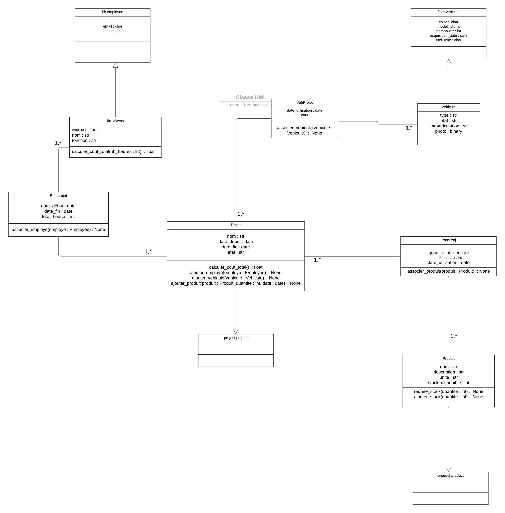

Gestion des Coûts d’un Projet de Construction
=============================================

Consignes du Projet
==================
On désire gérer le volet physique d’un projet de construction impliquant deux types de ressources :
-	Des produits correspondant à des quantités utilisées au jour le jour. Le cout est variable par journée. Les produits utilisés sont issus d’un processus d’achats.
-	Des employés travaillant dans le projet et correspondant à un taux J/H donné chacun et à une fonction (ouvrier, contremaitre, architecte …)
-	Des véhicules sollicités avec un coût quotidien variable
Les profils sollicités dans le cadre de la gestion des projets sont :
l’acheteur : Responsable de la gestion des achats des produits.
le responsable de projets : Superviseur général des ressources et des coûts associés.

Objectifs du Projet
==================
L’objectif est de saisir les différents coûts projet et d’avoir une situation actualisée à date pour chacun des trois pavés précités (produits, RHs et véhicules).

Diagramme UML
=============
Le diagramme de classes suivant présente la structure du projet et les relations entre les entités principales :

